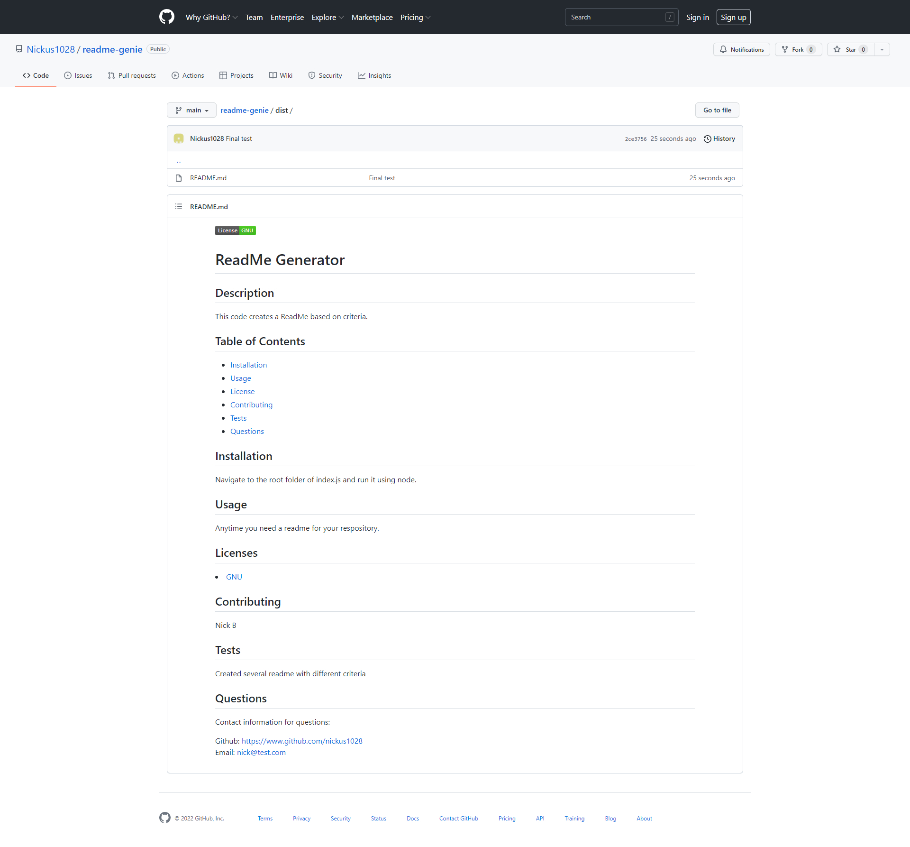

# Challenge 9: ReadMe Generator

## Description
Create a readme file for your respository based on a questionaire using Javascript and Node.js.

## Screenshot
</img>

## Video                    
https://watch.screencastify.com/v/EacfyHnpyBrdPo8aefLA
                                                                                       
## Installation
Navigate to the index.js file in Terminal and run it using node.

## Usage
Create a readme for any of your repositories.

## Questions
Contact information for questions:  

Github: https://www.github.com/nickus1028  
Email: nick@test.com
